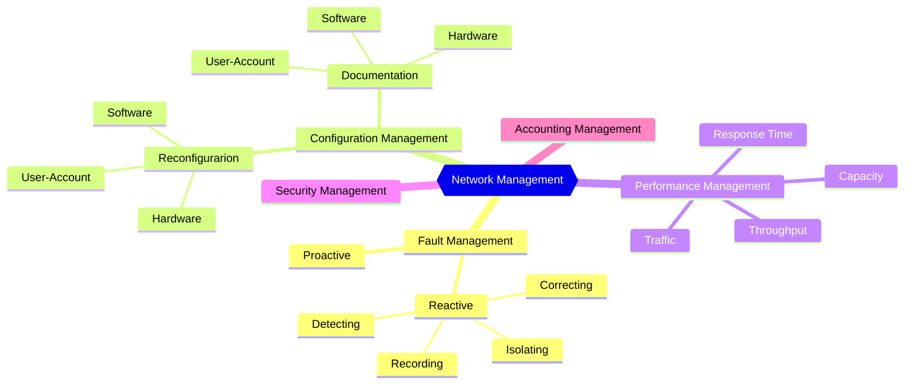

# Network Management System

Network Management can be defined as monitoring, testing, configuring & trouble shooting
network components to meet a set of requirements defined by an organization. The International 
Organization for Standardization (ISO) defines five areas of N/W Management:

The ITU-T FCAPS Model Reference ITU-T M.3400 and ISO / IEC 7498-4 (Open Systems 
Interconnection—Basic Reference Model, Part 4: Management Framework), describes the main 
objectives of each functional area in the FCAPS model.

| Management Funtion Areas (MFAa) | Management Function Set Groups       |
| ------------------------------  | ------------------------------------ |
| **F**ault                       | Alarm surveillance; Fault Localization & Correlation; Testing; Trouble Adminstration; Network Recovery; |
| **C**onfiguration               | Netowrk Planning & Engineering; Installation; Service Planning & Negotioation; Discovery; Provisioning; Status & control; |
| **A**ccounting                  | Usage Measurment, Collection, Aggregation, Mediation; Tariffing & Pricing |
| **P**erformance                 | Performance Monitoring & Control; Performance Analysis & Trending; Quality Assurance |
| **S**ecurity                    | Access Control & Policy; Customer Profiling; Attack Detection, Prevention, Containment & Recovery; Security Adminstration |

## Configuration Management

- A large network is usually made up of hundreds of entities that are physically or logically  connected to each other. 
- These entities have an initial configuration when the network is set up, but can change with time.
    * Desktop computers may be replaced by others; 
    * application software may be updated to a newer version; 
    * and users may move from one group to another.
The **configuration management** system must know, at any time, the status of each entity and it’s 
relation to other entities. 
Configuration management can be divided into two subsystems: **reconfiguration** and 
**documentation**.

### Reconfiguration
- Reconfiguration can be a daily occurrence in a network.
- 3 types of reconfiguration: 
    * Hardware, 
    * Software
    * User-Account Reconfiguration

#### Hardware Reconfiguration
- Hardware reconfiguration covers all changes to the hardware. 
- For example:
    * A desktop computer may need to be replaced.
    * A router may need to be moved to another part of the network. 
    * A subnetwork may be added or removed from the network.

#### Software Reconfiguration
- Software reconfiguration covers all changes to the software. 
- For example: 
    * New software may need to be installed on servers or clients. 
    * An operating system may need updating. 
- Fortunately, most software reconfiguration can be automated.

#### User-Account Reconfiguraion
- User-account reconfiguration is not simply adding or deleting users on a system. 
- Must also consider the user privileges, both as an individual and as a member of a group. 
- For example:
    * A user may have both read and write permission with regard to some files, but only read permission with regard to other files. 
- User-account reconfiguration can be, to some extent, automated.

### Documentation
- The original network configuration and each subsequent change must be recorded meticulously. 
- Documentation is extremely important for several reasons:
    * The problem may reoccur. 
    * Can help to tackle similar problem. 
    * The frequency of the same kind of failure is an indication of a major problem in the system. 
    * The statistic is helpful to another part of network management, performance management
- This means that there must be documentation for hardware, software, and user accounts.

#### Hardware Documentation
- Documentation of h/w related information and involves 2 sets of documents: **maps** and **specifications**

!!! Types
    === "Maps"
        - Track each piece of hardware and its connection to the network. 
        - There can be one general map that shows the logical relationships between subnetworks. 
        - For each subnetwork, there is one or more maps that show all pieces of equipment.
    === "Specifications"
        - Maps are not enough. 
        - Each piece of hardware also needs to be documented.
        - There must be a set of specifications for each piece of hardware connected to the network. 
        - These specifications must include information such as 
            * hardware type, 
            * serial number, 
            * vendor (address and phone number), 
            * time of purchase, and 
            * warranty information

#### Software Documentation
- All software must also be documented. 
- Software documentation includes information such as 
    * the software type, 
    * the version, 
    * the time installed, and 
    * the license agreement.

#### User-Account Documentation
- Some operating systems record access privileges in two documents 
    * One shows all files and access types for each user
    * The other shows the list of users that have access to a particular file.

## Fault Management
- A fault is defined as an abnormal condition in the system. 
- When a fault occurs, either the system stops working properly or the system creates excessive errors. 
- A good example of a fault is a damaged communication medium.
- Fault management is the area of network management that handles
    * Proper operation of the network 
    * Which depends on the proper operation of each component individually and in relation to each other.
    * An effective fault management system has two subsystems: 
- Reactive Fault Management and 
- Proactive Fault Management.

### Reactive Fault Management
- It is responsible for 
    * Detecting: To find exact location of the fault
    * Isolating: Isolated fault usually affects only a few users
    * Correcting: May involve replacing or repairing the faulty components. 
    * Recording faults:
        * After the fault is corrected, it must be documented. 
        * The record should show 
            * the exact location of the fault, 
            * the possible cause, 
            * the action or actions taken to correct the fault, 
            * the cost, and 
            * the time it took for each step
- It handles short-term solutions to faults

### Proactive Fault Management
- Tries to prevent faults from occurring. 
- Although this is not always possible, some types of failures can be predicted and prevented.
- For example:
    * Lifetime for a component or a part of a component.
    * Frequent faults in a network or at a component.

## Performance Management
- Performance management tries to monitor and control the network to ensure that it is running as efficiently as possible. 
- It tries to quantify performance using some measurable quantity, such as 
    * Capacity
    * Traffic
    * Throughput
    * Response time

## Security Management
- Security management is responsible for controlling access to the network based on predefined policy. 
- Security tools such as encryption and authentication are implemented. 
- Encryption allows privacy for users. 
- Authentication forces the users to identify themselves.

## Accounting Management
- Accounting management is the controlling of users’ access to network resources through charges. 
- Under accounting management, individual users, departments, divisions, or even projects are charged for the services they receive from the network. 
- Charging does not necessarily mean cash transfer; it may mean debiting the departments or divisions for budgeting purposes.